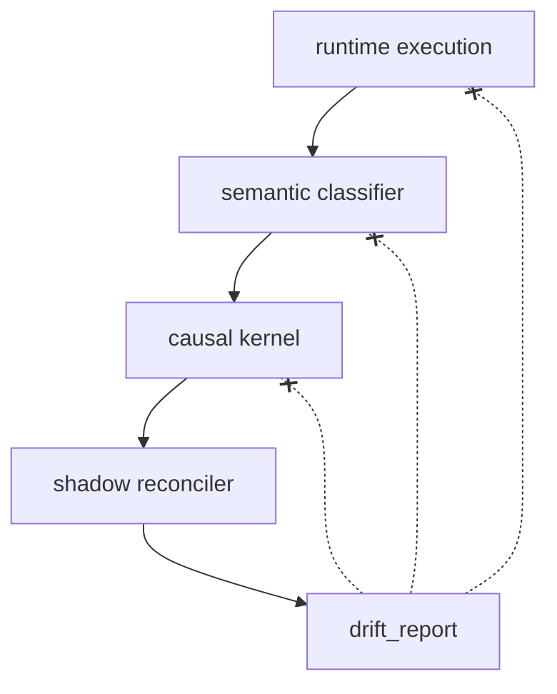

# ADR-0055: Observation Not Correction Boundary

Status: Accepted

This ADR defines the observation boundary for shadow reconciliation between runtime execution, semantic admissibility, and canonical causal truth.

```text
RFC-0052 answers: What is a subject?
ADR-0052 answers: How is subject authority represented in runtime?
ADR-0053 answers: Who may interpret causality into state?
ADR-0054 answers: How may runtime mutations enter the authority model?
ADR-0055 answers: What may divergence measurement do, and what must it never do?
```

RFC-0052 froze subject ontology.

ADR-0052 froze the canonical/derived runtime boundary.

ADR-0053 froze the evaluation boundary.

ADR-0054 froze the write-path classification boundary.

ADR-0055 freezes the observation boundary for Slice 2b.

## Acceptance Criteria

ADR-0055 is accepted when the following observation boundaries are frozen:

```text
Observation boundary frozen.
Drift report classified as measurement artifact.
Observation has no authority.
No automatic correction semantics.
No feedback path from observation to execution.
```

Slice 2b introduces divergence measurement. It does not introduce correction, enforcement, or remediation.

## Constitutional Kernel

```text
Observation does not imply correction.
Measurement does not imply authority.
Divergence does not imply action.
```

A drift report measures semantic distance between layers. It does not prescribe what the system should do about that distance.

```text
measurement is not optimization
observation space != control space
```

## Scope

This ADR governs:

```text
shadow reconciliation observer role
drift report semantics
causal inertness of observation
forbidden feedback paths
```

This ADR does NOT govern:

```text
remediation of drift
enforcement of kernel truth over runtime
automatic projection repair
authority history correction
who may react to drift (future Slice 3 territory)
```

Slice 2b is a deterministic divergence oracle, not a decision system.

## Relation To Existing Layers

```text
RFC-0052: ontology
ADR-0052: runtime boundary (canonical vs derived)
ADR-0053: evaluation boundary (who interprets causality)
ADR-0054: write-path classification boundary (how mutations enter the model)
ADR-0055: observation boundary (what divergence measurement may do)
```

ADR-0055 is not a new identity primitive.

It constrains what the shadow reconciler may output and how that output may be used.

## Four Realities After Slice 2b

```text
runtime        = execution reality (what happens)
classifier     = semantic admissibility (what is allowed to mean)
kernel         = canonical causality (what is causally true)
reconciler     = divergence measurement (where realities disagree)
```

None of these layers may simulate another.

The reconciler is a meta-layer that does not belong to system state. It measures inconsistency without resolving it.

## Reconciler Contract

The shadow reconciler:

```text
consumes runtime_projection
consumes classified_events (or event_log for classification)
consumes canonical_subject_state
produces drift_report
```

The reconciler MUST:

```text
be deterministic over same inputs
be pure and side-effect free
be referentially transparent
be execution-context independent
classify drift as measurement, not error
```

The reconciler MUST NOT:

```text
modify runtime state
modify authority history
modify projections
modify classified_events
modify canonical_subject_state
produce corrective instructions
produce recommendations or fixes
produce prioritization or severity-based action mapping
produce enforcement flags or correction targets
feed back into runtime, classifier, or kernel
```

## Drift Report Semantics

A `drift_report` is a measurement artifact, not an authority artifact.

```text
drift != bug
drift != inconsistency to be auto-fixed
drift = measured semantic distance between layers
```

Drift types:

```text
execution_drift   # runtime violates admissibility constraints (e.g. represents reject-class event)
semantic_drift    # runtime-believed class differs from classifier output
authority_drift   # admissible authority subset != canonical applied events
projection_drift  # runtime projection != derived canonical projection
unknown_drift     # legacy_unknown accumulation without resolution path
```

A drift report MUST contain:

```text
schema_version
ruleset_version
subject (when known)
has_drift
drift_types_present
summary (counts per drift type)
drifts (factual divergence records)
```

A drift report MUST NOT contain:

```text
actions
recommendations
fixes
remediation
prioritization
severity
enforcement
correction_targets
decision
suggested_action
```

## Pipeline

Observation is one-directional. There is no feedback loop.

```text
runtime
  -> classifier
  -> kernel
  -> reconciler
  -> drift_report
```

Forbidden feedback paths:

```text
drift_report -> runtime        # INVALID
drift_report -> classifier     # INVALID
drift_report -> kernel         # INVALID
drift_report -> authority_history  # INVALID
drift_report -> projection mutation  # INVALID
```

The reconciler observes divergence. It does not participate in resolution.



## Forbidden Patterns

### Drift-Driven Correction

Invalid:

```text
if (drift.execution_drift) {
  repairProjection();
}
```

Invalid:

```text
if (drift.authority_drift) {
  rewriteAuthorityHistory();
}
```

Observation must not become control.

### Prescriptive Drift Reports

Invalid:

```json
{
  "has_drift": true,
  "recommendations": ["sync controllers with canonical state"],
  "severity": "high",
  "enforcement": true
}
```

A drift report describes distance. It does not prescribe direction.

### Observer As Optimizer

Invalid:

```text
reduce drift automatically
minimize divergence as system goal
use drift_report as runtime input
```

Measurement is not optimization.

## Runtime Invariants

```text
observation_does_not_imply_correction = true
measurement_does_not_imply_authority = true
divergence_does_not_imply_action = true
drift_report_is_measurement_artifact = true
reconciler_is_causally_inert = true
reconciler_is_non_prescriptive = true
no_feedback_from_observation_to_execution = true
same_inputs_same_drift_report = true
```

## Controlled Remediation Decision Point

Only after explicit future architectural decision may the system define who, if anyone, has the right to react to drift.

That decision is outside ADR-0055.

ADR-0055 freezes observation without correction. Remediation is a future boundary, not an implicit extension of measurement.

```text
Slice 2b: runtime becomes observable (divergence measured)
Future slice: who may react to drift (explicit decision only)
```

## Sequencing

```text
RFC-0052
  -> ADR-0052 (runtime boundary)
  -> ADR-0053 (evaluation boundary)
  -> Slice 1 kernel (executable causality)
  -> ADR-0054 (write-path classification boundary)
  -> Slice 2a classifier (semantic admissibility)
  -> ADR-0055 (observation not correction boundary)
  -> Slice 2b reconciler (divergence measurement)
  -> future: controlled remediation (if ever)
```

## Executable Reference

This observation boundary is realized by a pure, runtime-independent reconciler (Slice 2b).
The documents below reference the executable reconciler, not the other way around.

```text
docs/contracts/subject-authority/fixtures/shadow-reconciliation-v1.json  (oracle fixtures)
node/subject-authority-shadow-reconciler.js                              (deterministic divergence oracle)
node/scripts/test-subject-authority-shadow-reconciler.js                 (purity and non-prescription oracle)
```

The reconciler has no runtime, HTTP, or storage dependencies. It produces
`drift_report` as a measurement artifact and must remain causally inert with
respect to runtime, classifier, and kernel.

## Non-Goals For This Boundary

```text
server.js behavior changes
ledger_db.json changes
HTTP/API contract changes
automatic drift correction
enforcement hooks
feedback loops from drift_report to any layer
```

ADR-0055 is a semantic boundary document. Implementation follows in a separate Slice 2b artifact.
