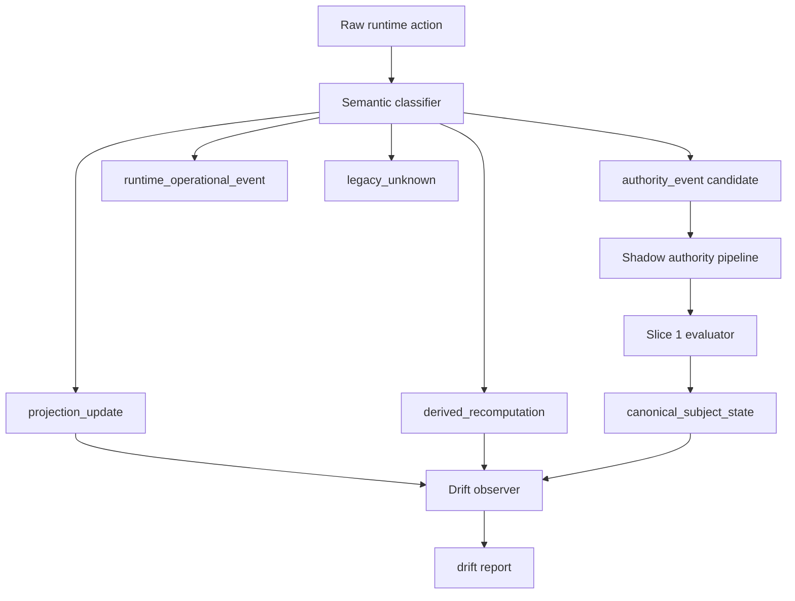

# ADR-0054: Semantic Write-Path Classification Layer

Status: Accepted

This ADR defines the classification boundary for runtime mutations that affect subject authority semantics.

```text
RFC-0052 answers: What is a subject?
ADR-0052 answers: How is subject authority represented in runtime?
ADR-0053 answers: Who may interpret causality into state?
ADR-0054 answers: How may runtime mutations enter the authority model?
```

RFC-0052 froze subject ontology.

ADR-0052 froze the canonical/derived runtime boundary.

ADR-0053 froze the evaluation boundary.

ADR-0054 freezes the write-path classification boundary for Slice 2.

## Acceptance Criteria

ADR-0054 is accepted when the following write-path boundaries are frozen:

```text
No runtime mutation may define identity semantics implicitly.
Classification happens before mutation, not after.
Shadow mode evaluates truth without enforcing it.
Drift between runtime projection and canonical subject state is observable.
Runtime remains accountable, not authoritative.
```

Slice 2 introduces friction between truth and execution. It does not yet enforce convergence.

## Constitutional Kernel

```text
No runtime mutation is allowed to be semantically unclassified.
```

Every state change that affects subject continuity, authority domains, or derived identity projections MUST belong to a known classification before mutation occurs.

```text
Every state change must belong to a known authority domain
or be rejected as legacy/unknown.
```

## Scope

This ADR governs:

```text
write-path discovery
semantic classification
shadow authority pipeline
drift observation
```

This ADR does NOT govern:

```text
enforcement of kernel truth over runtime
HTTP/API contract changes
projection schema redesign
migration of legacy event types
```

Slice 2 is a controlled mutation boundary with independent verification loop, not an `applyEvent()` refactor.

## Relation To Existing Layers

```text
RFC-0052: ontology
ADR-0052: runtime boundary (canonical vs derived)
ADR-0053: evaluation boundary (who interprets causality)
ADR-0054: write-path classification boundary (how mutations enter the model)
```

ADR-0054 is not a new identity primitive.

It constrains how operational runtime actions are classified before they may affect subject authority semantics.

## Classification Model

A raw runtime action MUST be classified into exactly one of the following categories before mutation:

```text
authority_event_candidate
projection_update
derived_recomputation
runtime_operational_event
legacy_unknown
reject
```

### authority_event_candidate

A mutation that, if accepted, would append or imply a valid `authority_event` in an authority domain.

Examples:

```text
GENESIS
PASSKEY_ADDED
PASSKEY_REVOKED
CONTROLLER_BINDING_PROPOSED
CONTROLLER_BINDING_APPROVED
NATIVE_CONTROLLER_BOOTSTRAPPED
CONTROL_GRANT_CREATED
CONTROL_GRANT_REVOKED
```

Classification does not create the event. It only asserts that the action claims authority to change a scoped authority graph.

### projection_update

A mutation that updates a materialized view derived from authority history.

Examples:

```text
ledger.accounts[...] update during replay
controller_bindings projection write
marketplace seller/listing projection write
```

Projection updates are permitted only when lineage to authority history is auditable.

### derived_recomputation

A mutation that recomputes derived state without introducing new authority facts.

Examples:

```text
calculateStateRoot()
projection rebuild during replay
federation root recompute from existing state
```

Derived recomputation MUST NOT invent authority semantics.

### runtime_operational_event

A mutation that affects operational runtime state but does not claim subject authority continuity.

Examples:

```text
cluster_genesis timestamp assignment
settlement event ring buffer append
network mailbox persistence
install report persistence
```

These events may affect runtime behavior but MUST NOT be treated as canonical authority history unless explicitly bridged.

### legacy_unknown

A mutation whose subject-authority semantics are not yet accepted by the bridge or classifier.

Examples:

```text
unsupported legacy event type
capsule rehydration without accepted bridge mapping
direct ledger.account injection outside event log
```

`legacy_unknown` actions MUST be observed and reported. They MUST NOT silently become authority truth.

### reject

A mutation that violates frozen invariants or attempts projection mutation as authority.

Rejected actions MUST NOT mutate canonical-adjacent identity state.

## Classification Pipeline

Classification happens before mutation, not after.

```text
Raw runtime action
  -> semantic classifier
  -> classification result
  -> mutation surface (if permitted)
  -> shadow authority pipeline (parallel)
  -> drift observer
```



The classifier MUST NOT:

```text
mutate authority history
infer ownership from projections
redefine authority domains for convenience
collapse device authority into generic ownership
accept post-mutation reclassification
```

## Write-Path Discovery Layer

Before integration, runtime mutation surfaces MUST be discovered and classified, not modified.

The current primary mutation chokepoint is `applyEvent()` in `node/server.js`:

```text
applyEvent(event, isInitialReplay)
  -> switch(event.type)
  -> projection mutation via delegated runtime modules
  -> ledger.event_log.push(event)        # when not replay
  -> calculateStateRoot()
  -> saveLedger()
```

This chokepoint covers the event-sourced surface. It is the primary integration target for shadow classification.

The following bypass-write surfaces MUST also be classified separately because they mutate ledger state outside `applyEvent()`:

```text
rememberVerifiedCapsuleOwner()           # capsule rehydration into accounts/controller_bindings
dev admin onboarding injection           # direct ledger.accounts write at boot
governance epoch enactment               # governance mutation + saveLedger outside event log
federationRegistry._recomputeFederationRoot()
settlement event ring buffer append      # ledger.settlement_events.push without event log
```

A complete authority boundary requires classification of both the chokepoint and all bypass surfaces.

## Shadow Authority Pipeline

Slice 2 operates in shadow mode:

```text
runtime writes continue unchanged
parallel kernel evaluates truth
no enforcement yet
```

Shadow pipeline:

```text
legacy event or runtime action
  -> classify
  -> legacyEventToAuthorityEvent() when bridge mapping exists
  -> append to shadow authority_history (in-memory or side log)
  -> evaluateAuthorityHistory()
  -> deriveCanonicalSubjectState()
```

The shadow pipeline MUST NOT:

```text
block runtime writes
modify ledger_db.json authority semantics
replace applyEvent() behavior
enforce kernel truth over runtime output
```

Shadow mode makes runtime accountable without making runtime obedient.

## Drift Observation Layer

After shadow evaluation, the system MUST compare:

```text
runtime_projection  vs  canonical_subject_state
```

When they diverge, emit a drift report. Do not mutate runtime state to resolve drift automatically.

```text
runtime_projection != canonical_subject_state
  -> drift report
```

A drift report MUST include:

```text
subject
classification
runtime_path
authority_domain (if applicable)
reason_code
projection_field or relation affected
timestamp
```

Drift observation makes semantic mismatch visible. It does not yet correct it.

Reason codes for drift SHOULD align with the frozen taxonomy in `docs/contracts/subject-authority/invariants/ruleset-v1.json`, including:

```text
PROJECTION_INPUT_REJECTED
BRIDGE_FACT_INVENTION
UNSUPPORTED_LEGACY_EVENT_TYPE
CAUSAL_REFERENCE_MISMATCH
ACTION_DOMAIN_MISMATCH
```

Additional drift-specific codes MAY be introduced in a future contract extension. They MUST NOT redefine frozen Slice 1 semantics.

## Forbidden Patterns

### Projection Mutation As Authority

Invalid:

```text
edit ledger.accounts[subject] directly
  -> becomes de facto authority transition
```

Valid:

```text
classify action
  -> authority_event_candidate or legacy_unknown
  -> shadow evaluate
  -> drift report if projection diverges
```

### Post-Mutation Classification

Invalid:

```text
mutate ledger
  -> classify afterward
  -> justify semantics retroactively
```

Classification MUST precede mutation.

### Runtime-Specific Identity Shortcuts

Invalid:

```text
runtime convenience field becomes canonical subject meaning
application profile write redefines subject continuity
provider record treated as authority root
```

### Owner Semantics Collapse

Invalid:

```text
device owner relation treated as Layer D asset ownership
generic "owner" field used as canonical identity primitive
```

Device authority is scoped device authority, not global ownership.

## Runtime Invariants

```text
no_unclassified_mutation = true
classification_before_mutation = true
runtime_may_host_projections = true
runtime_must_not_interpret_authority = true
shadow_mode_no_enforcement = true
drift_must_be_observable = true
kernel_truth_independent_of_runtime = true
canonical_subject_state = replay(authority_history)
```

## Controlled Convergence Decision Point

Only after shadow mode produces stable drift telemetry may the system decide where runtime must obey kernel truth.

That decision is outside ADR-0054.

ADR-0054 freezes observation and classification. Enforcement is a future boundary.

```text
Slice 1: ontology becomes computable
Slice 2: runtime becomes accountable
Future slice: runtime becomes convergent (explicit decision only)
```

## Sequencing

```text
RFC-0052
  -> ADR-0052 (runtime boundary)
  -> ADR-0053 (evaluation boundary)
  -> Slice 1 kernel (executable causality)
  -> ADR-0054 (write-path classification boundary)
  -> shadow classifier implementation
  -> drift observer implementation
  -> controlled convergence decision
```

## Executable Reference

This classification boundary is realized by Slice 2 shadow-mode components that reference the Slice 1 kernel. Documents reference the executable kernel, not the other way around.

Frozen executable references:

```text
docs/contracts/subject-authority/schema/authority-event.schema.json
docs/contracts/subject-authority/invariants/ruleset-v1.json
docs/contracts/subject-authority/fixtures/conformance-v1.json
node/subject-authority-runtime.js
node/scripts/test-subject-authority-runtime.js
```

Future Slice 2 implementation targets (not yet present):

```text
write-path classifier (pre-mutation semantic filter)
shadow authority pipeline (parallel evaluation)
drift observer (runtime_projection vs canonical_subject_state)
```

The kernel has no runtime, HTTP, or storage dependencies. Classification and drift observation MUST preserve that independence.

## Non-Goals For This Boundary

```text
server.js behavior changes
ledger_db.json changes
HTTP/API contract changes
Slice 1 kernel changes
automatic drift correction
enforcement of kernel truth over runtime
```

ADR-0054 is a semantic boundary document. Implementation follows in a separate Slice 2 artifact.
